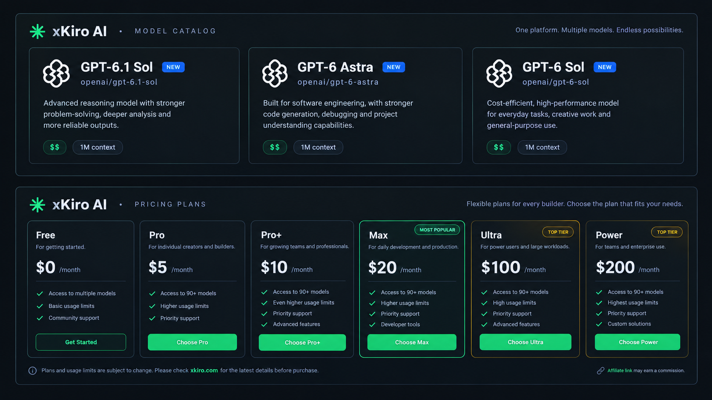

# xKiro AI

## More AI models, one API, one budget

Want to build with AI without juggling a separate integration for every provider? [xKiro](https://xkiro.com) brings access to multiple AI models together through a single API, making it easier to try different models, keep your app flexible, and manage your AI usage in one place.

### Why try xKiro?

- **One integration:** Connect to multiple models through one API instead of maintaining provider-specific setups.
- **More room to choose:** Pick a model that fits the task, whether you're prototyping, coding, or building an application.
- **Simpler cost management:** Keep usage in one account and review current plans and rates before you build.
- **Less vendor lock-in:** Make it easier to experiment with alternatives as your needs change.

Whether you're an independent developer watching costs or a team building an AI-powered product, xKiro can help simplify the path from idea to implementation. Check the [current plans and pricing](https://xkiro.com/dashboard/pricing) to see what fits your budget.

### Try xKiro

[Sign up with my referral link](https://xkiro.com/ref/5QKE4YD) — new users get **10% off their first top-up** according to the referral offer.

**Affiliate disclosure:** This is my referral link. I may earn a commission when you make a purchase through it, at no additional cost to you.

### Learn more

- [Visit xKiro](https://xkiro.com)
- [Explore the documentation](https://docs.xkiro.com/)
- [View plans and pricing](https://xkiro.com/dashboard/pricing)
